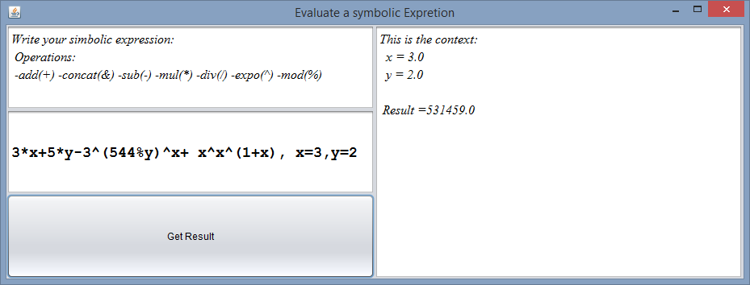
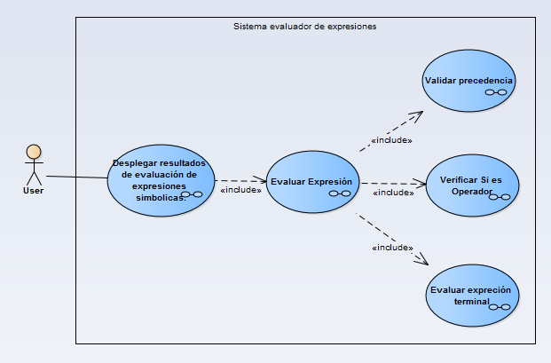
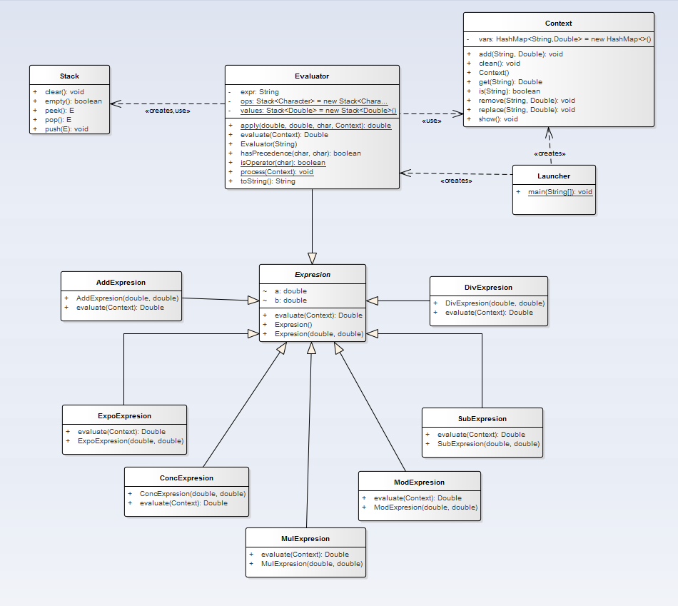

# Evaluate an expression

>"In this project is shown a algorithm to evaluate a symbolic expression."

Patterns used in this project
 - Factory Method
 - Interpreter

## Result

## How to use it?

you can write an expression as a string for instance String s = "a+b" after that you write the values of the variables a  and b as follows 

a+b, a=5, b =7

The software accept this operations 
Exponentiation ^ 
Addition +
Subtraction  -
Multiplication * 
Concatenation &
Modulus % 

If you want you can define another operation, "Interpreter pattern" <3

## Models

### Functional Model

### Structural Model

